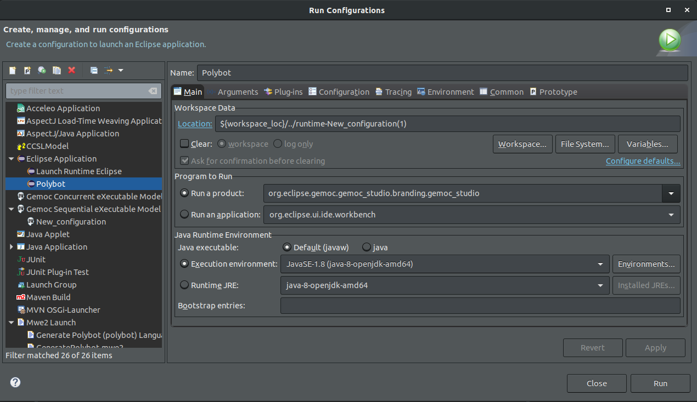
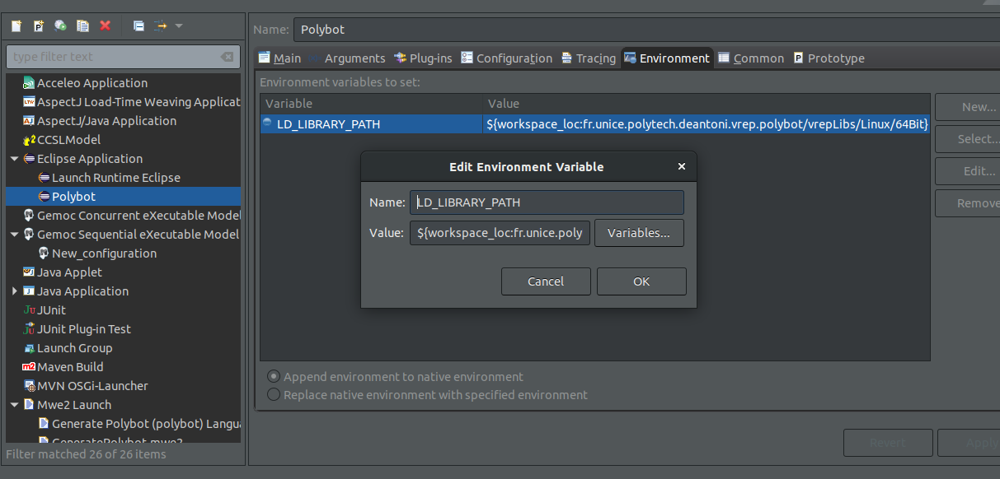
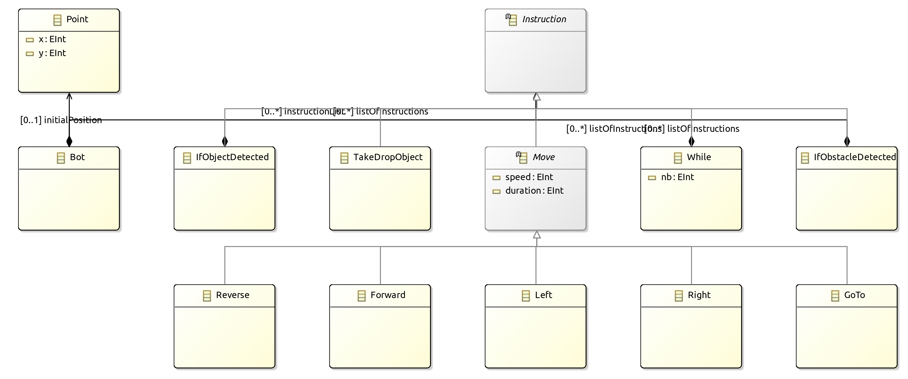

# DZIRI Aghiles SI5-IAM
Ce projet a été fait sous Ubuntu 18.04

### Requis :
[Gemoc studio](https://ci.inria.fr/gemoc/job/gemoc-studio-eclipsefork/job/concurrency-coordination/lastSuccessfulBuild/artifact/gemoc-studio/gemoc_studio/releng/org.eclipse.gemoc.gemoc_studio.product/target/products/)
[V-REP](http://www.coppeliarobotics.com/)
### Utilisation du projet :
Normalement le projet devrait se lancer correctement après le clone du git et l'import du projet sous GeMoc studio.
* Dans le cas où le projet ne fonctionne pas :
 *  Importer le projet
 *  Ajouter le projet "fr.unice.polytech.deantoni.vrep.polybot" dans le workspace
 *  Créer une application Eclipse comme sur cette image :
 
 *  Ajouter la variable d'environnement (voir image) :
  
   ```
 LD_LIBRARY_PATH = ${workspace_loc:fr.unice.polytech.deantoni.vrep.polybot/vrepLibs/Linux/64Bit}
 ```
 * Après cela il faut run l'application. Une deuxième fenêtre d'eclipse apparaîtra.
 * Ajouter la scene (polyBotVersusPaintBomb.ttt) à V-vrep
 * Lancer le programme de la deuxième fenêtre

### Le modele Ecore du projet :

### Les instructions disponibles :
* **Bot** : Le point d'entrée du programme.
```
Bot {
  instructionList {
    //les instructions du programme séparée par des virgules (,)
  }
}
```
* **Right** : Permets de tourner à droite en donnant en paramètre la vitesse et la durée.
```
  Right (20;350)
```
* **Left** : Permets de tourner à gauche en donnant en paramètre la vitesse et la durée.
```
  Left (20;350)
```
* **Reverse** : Permets de faire marche arrière en donnant en paramètre la vitesse et la durée.
```
  Reverse (20;350)
```
* **Forward** : Permets d'avancer en ligne droite en donnant en paramètre la vitesse et la durée.
```
  Forward (20;350)
```
* **IfObjectDetected** : Permets d’exécuter les instructions si l'objet détecté est une bombe.
```
IfObjectDetected{ //si une bombe est détectée faire les instructions sinon rien
		//instructions séparée par des virgules (,)
}
```
* **IfObstacleDetected** : Permets d’exécuter les instructions si l'objet détecté est un obstacle (mur).
```
IfObstacleDetected{ //si un obstacle est détecté faire les instructions sinon rien
		//instructions séparée par des virgules (,)
}
```
* **TakeDropObject** : Permets de prendre la bombe.
```
TakeDropObject
```
* **While** : Permets de faire une boucle sur les instructions.
```
While(15) { // le nombre de boucles 15 (répéter 15 fois)
			//instructions séparée par des virgules (,)
}
```

### Exemple de programme :
```
Bot {
    init Point (12;12)
    instructionList {
        While(15) {
            Right (20;350),
            Forward (20;5000),
            IfObjectDetected{
                TakeDropObject
            },
            IfObstacleDetected {
                Right (20;400)
            }
        }

    }
}
```
### Critiques :

###### inconvénients :
 * Ce langage permets de faire beaucoup de choses. Mais un problème majeur se pose. Si on veut faire un programme complexe, Le programmeur devrait faire tous le travail avec des instructions basiques.
 * Ne permet pas la visualisation des logs.

###### Avantages :
 *  Un grand contrôle de la part de l’utilisateur
 *  Facile à utiliser
